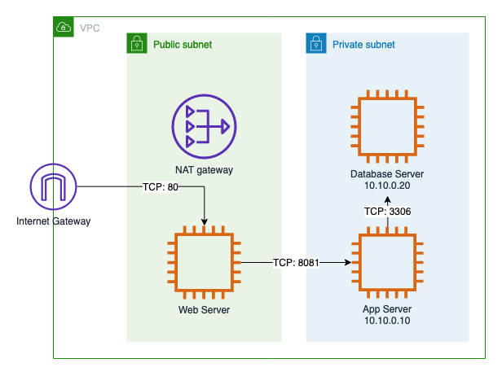

# Deploy with Terraform

This document outlines the steps required to deploy the web app using terraform.

## Prerequisites
1. AWS account CLI credentials
2. [Terraform](https://learn.hashicorp.com/tutorials/terraform/install-cli) 
3. Access to the respective AMIs (not public)
    * Web instance (`ami-0d38e3348f242b184`, WebServer - v2 (React Nginx)) 
    * App instance (`ami-04fa1e528a9c7bf67`, AppServer - v3 (Node))
    * DB instance (`ami-01a02370342aded44`, DatabaseServer - v3 (MySQL))

## Steps to launch the web app

1. Configure AWS credentials by running the following command and entering your `AWS Access Key ID` and `AWS Secret Access Key`.
```
aws configure
```
2. Run the Terraform script
```
cd terraform/
terraform plan
terraform apply
```
3. Once the resources are provisioned, visit the HTTP address of the web server public dns (Output from Terraform).

## Architecture


The diagram above shows a VPC with 1 public subnet and 1 private subnet. An internet gateway is attached to the VPC for allowing internet traffic into the VPC. The NAT gateway allows for instances in the private subnet to communicate with external services.

Respective security groups are applied accordingly to the EC2 instances based on TCP ports shown in the diagram, as well as port 22 for SSH if troubleshooting is required.

## Extra info

### Fixed private IP addresses
In order to ensure that the Web Server can communicate with the App Server, and likewise for the App Server and Database Server, private IPs are set to be 
* `10.10.0.10` for App Server
* `10.10.0.20` for Database Server

This allows for the private IPs to be hardcoded in Nginx's proxy and Node's MySQL connection, so that once the instances launch the web app will be ready.

As such, Nginx is configured to proxy `/api` requests over to `10.10.0.10` in the config file at `/etc/nginx/sites-available/default`.
```
server {
    listen 80 default_server;
    listen [::]:80 default_server;

    root /var/www/build;
    index index.html index.htm index.nginx-debian.html;

    server_name _;

    location / {
        # First attempt to serve request as file, then
        # as directory, then fall back to displaying a 404.
        try_files $uri /index.html $uri/ =404;
    }
    
    location /api {
        proxy_pass http://10.0.10.10:8081;
    }
}
```

`webappdemo/backend/index.js` initiates a MySQL connection with the DB instance at `10.10.0.20`.

```js
const db = mysql2.createConnection({
    user: "myuser",
    host: "10.0.10.20", 
    password: "mypass",
    database: "employee_db"
})
```


### PM2
PM2 is a production process manager, and is configured to start the backend service once the App instance launches.

Reference: https://pm2.keymetrics.io/docs/usage/startup/