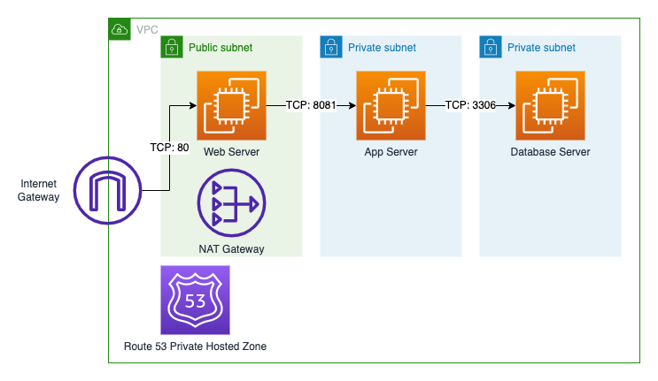

# Deploy with Terraform

This document outlines the steps required to deploy the web app using terraform. The Terraform code in this directory is able to deploy a 3 tier web application to any given 3 subnets in a VPC.

## Prerequisites
1. AWS account CLI credentials
2. [Terraform](https://learn.hashicorp.com/tutorials/terraform/install-cli) 
3. Access to the respective AMIs (not public)
    * Web instance (`ami-0fb753eb89a05c955`, WebServer - v3 (React Nginx)) 
    * App instance (`ami-0007744bbb2e238da`, AppServer - v4 (Node))
    * DB instance (`ami-01a02370342aded44`, DatabaseServer - v3 (MySQL))

## Steps to launch the web app

1. Configure AWS credentials by running the following command and entering your `AWS Access Key ID` and `AWS Secret Access Key`.
```
aws configure
```
2. If you have a custom VPC with subnets to deploy to, do edit `variables.tf` as needed.
---
**NOTE**

You may need to remove `key_name` entries from `ec2.tf` and replace it with your key pair.

---
3. Run the Terraform script
```
cd terraform/
terraform plan
terraform apply
```
4. Once the resources are provisioned, visit the HTTP address of the web server public dns (Output from Terraform).


## Architecture


* Each EC2 instance is deployed in a separate subnet
* Respective security groups are applied accordingly to the EC2 instances based on TCP ports shown in the diagram, as well as port 22 for SSH if troubleshooting is required.

## Extra info

### Private Hosted Zone
In order to ensure that the Web Server can communicate with the App Server, and likewise for the App Server and Database Server, the Private Hosted Zone is created to store records on routing traffic in the VPC between instances. 
* The Nginx web server proxies requests starting with `/api` to `backend.webapp.com`, which is the App Server.
* The App server initiates a mysql connection with the Database server at `database.webapp.com`.

Nginx config file at `/etc/nginx/sites-available/default` is as follows:
```
server {
    listen 80 default_server;
    listen [::]:80 default_server;

    root /var/www/build;
    index index.html index.htm index.nginx-debian.html;

    server_name _;

    location / {
        # First attempt to serve request as file, then
        # as directory, then fall back to displaying a 404.
        try_files $uri /index.html $uri/ =404;
    }
    
    location /api {
        proxy_pass http://backend.webapp.com:8081;
    }
}
```

`webappdemo/backend/index.js` is as follows:

```js
const db = mysql2.createConnection({
    user: "myuser",
    host: "database.webapp.com", 
    password: "mypass",
    database: "employee_db"
})
```

Under `variables.tf`, you may configure the private ip address of the App and Database instances, which is used to configure `ec2.tf` and `private_hosted_zone.tf`.

```terraform
variable "app_server_private_ip" {
  type    = string
  default = "10.0.1.10"
}

variable "db_server_private_ip" {
  type    = string
  default = "10.0.2.10"
}
```


### PM2
PM2 is a production process manager, and is configured to start the backend service once the App instance launches.

Reference: https://pm2.keymetrics.io/docs/usage/startup/